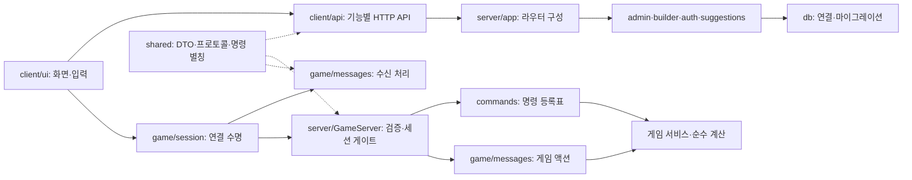

# MUD

TypeScript 기반 브라우저 MUD입니다. `client`는 화면과 HTTP/WebSocket 클라이언트, `server`는 HTTP API·게임 로직·SQLite 저장소, `shared`는 양쪽에서 사용하는 데이터 계약과 게임 규칙을 담당합니다.

## 실행과 검증

```sh
npm ci
npm run dev
npm run check
npm run test:smoke
```

- `npm run check`: 서버·클라이언트 테스트와 두 워크스페이스 빌드.
- `npm run test:smoke`: 공유 패키지와 서버를 빌드한 뒤, 임시 SQLite DB와 별도 포트로 빌드된 서버·Vite를 띄워 Chromium에서 로그인, 캐릭터 생성, 채팅, 관리자·빌더 화면 전환, 모달, 로그아웃·재로그인을 검증합니다. 프로세스와 임시 DB는 종료 시 정리합니다.
- 서버 테스트는 `DB_PATH=:memory:`를 사용합니다. 로컬 플레이 DB에 테스트 데이터를 쓰지 않습니다.
- Chromium이 없다면 `npx playwright install chromium`으로 설치합니다.

`shared`도 JavaScript로 빌드되며, 서버·클라이언트의 `prebuild`에서 의존 패키지 빌드를 실행합니다. 개발 모드에서는 `development` export 조건으로 공유 소스 변경을 바로 사용합니다. 빌드 후 `npm start -w server`로 실행할 수 있습니다.

서버 환경 변수는 `PORT`(기본 3001), `DB_PATH`, `DEFAULT_ADMIN_USERNAME`, `DEFAULT_ADMIN_PASSWORD`입니다. Vite의 API/WebSocket 프록시 대상은 `MUD_SERVER_URL`로 바꿀 수 있습니다.

## 구조와 책임



| 위치 | 책임 |
| --- | --- |
| `shared/src/api/` | 인증, 콘텐츠, 관리자, 빌더, 제안 HTTP DTO의 단일 정의 |
| `shared/src/protocol.ts` | WebSocket 메시지와 게임 스냅샷 |
| `shared/src/commands.ts`, `directions.ts` | 명령·이동 별칭과 자동완성 공통 데이터 |
| `shared/src/messageDispatcher.ts` | 메시지 종류별 페이로드 타입과 처리표의 완전성 보장 |
| `client/src/api/` | 공통 전송·오류 처리와 기능별 엔드포인트 |
| `client/src/ui/gameScreen.ts` | 게임 화면 구성과 화면 이동 |
| `client/src/ui/game/session.ts` | 연결 이벤트, 주기 갱신, Escape 처리와 해제 |
| `client/src/ui/game/messages.ts` | 서버 메시지를 게임 화면 상태에 반영 |
| `client/src/ui/game/events.ts`, `shell.ts`, `log.ts`, `types.ts` | 화면 이벤트, HTML, 로그, 컨텍스트 타입 |
| `server/src/app.ts` | HTTP 라우터 구성, 포트를 열거나 타이머를 시작하지 않음 |
| `server/src/runtime.ts` | HTTP/WebSocket 서버와 월드·마을 타이머 생성 및 종료 |
| `server/src/index.ts` | 포트 설정, 실행, 프로세스 종료 신호 |
| `server/src/*/routes.ts` | 도메인별 라우터 팩토리와 권한 미들웨어 |
| `server/src/http/validation.ts` | HTTP 요청 검증과 400 응답의 공통 처리 |
| `server/src/content/` | 콘텐츠 입력 스키마와 범위 검증, 라우트 등록 없이 재사용 가능 |
| `server/src/game/messages/` | WebSocket 입력 검증, 인증·직업 선택, 세션 액션 처리 |
| `server/src/game/commands/registry.ts` | 명령 등록과 별칭 충돌 검사 |
| `server/src/game/mobs/` | 몹 타입, 스탯 보간, 저장소와 독립적인 드랍 계산 |
| `server/src/db/connection.ts` | 경로를 받아 DB를 열고 실패 시 연결 정리 |
| `server/src/db/migrations/` | 스키마 진화, 위치·아이템·몹·존·NPC 백필과 실행 순서 |

`api.ts`, `adminApi.ts`, `builderApi.ts`, `suggestionApi.ts`는 기존 import를 유지하는 진입점입니다. 새 기능은 `client/src/api/`에 추가하고, DTO는 `shared/src/api/`에 정의합니다. 서버 DTO 변환 함수도 공유 타입을 반환하도록 선언해 계약의 불일치를 컴파일 시 확인합니다.

## 기능 확장

### 텍스트 명령

1. `shared/src/commands.ts`의 `COMMAND_ALIASES`에 명령 이름과 별칭을 추가합니다.
2. `server/src/game/commands/`의 해당 기능 모듈에 핸들러를 구현합니다.
3. `commands/index.ts`의 `handlers`에 연결합니다. 누락된 명령은 타입 검사에서 잡힙니다.

자동완성은 같은 공통 목록을 사용합니다. 이동 명령은 `directions.ts`에서 관리하며 `e`는 포털 입장 별칭입니다. 등록표는 이름이나 별칭이 중복되면 시작 시 오류를 냅니다.

### WebSocket 액션

1. `shared/src/protocol.ts`에 메시지 종류와 페이로드를 정의합니다.
2. `server/src/game/messages/schema.ts`에 런타임 입력 검증을 추가합니다.
3. 세션 액션은 `messages/session.ts` 처리표에 등록합니다. 서버에서 보내는 새 메시지는 클라이언트 `game/messages.ts`에도 등록합니다.

처리표는 프로토콜의 모든 메시지 종류를 요구하고, 각 핸들러에 해당 종류의 페이로드만 전달합니다. 인증과 직업 선택은 세션 액션보다 먼저 처리합니다.

### HTTP 기능

각 기능 파일은 `register…Routes(router)`로 라우트를 등록합니다. 모듈을 import하는 것만으로 라우트가 등록되지 않습니다. 도메인 `routes.ts` 팩토리에 등록 함수를 연결하고 권한 미들웨어 뒤에 배치합니다. 콘텐츠 검증은 `content/`, 공통 요청 검증은 `http/validation.ts`에서 재사용합니다.

### DB 변경과 게임 계산

DB 초기화 순서는 `db/migrations/index.ts`에서 명시적으로 관리합니다. 기존 스키마·시드·백필의 순서와 실행 조건은 유지했습니다. 새 백필은 해당 도메인 파일에 넣고 순서 목록에 연결하며 재실행 시 데이터 보존을 검증합니다. `openDatabase(':memory:')`로 별도 DB를 만들 수 있습니다.

게임 계산은 가능한 한 DB 조회와 분리합니다. 예를 들어 `mobs/loot.ts`는 조회된 풀과 난수 함수를 받아 계산하므로 시뮬레이션에서도 재사용할 수 있습니다. 현재 게임 서비스는 프로세스 공통 DB와 월드 상태를 사용하므로 라우터 팩토리 여러 개가 별도 게임 월드를 만드는 것은 아닙니다.

## 연결과 화면 수명

게임 화면을 관리자·빌더 화면에서 돌아와 다시 그릴 때 기존 연결과 게임 상태를 이어 사용합니다. 세션 이벤트는 현재 컨텍스트를 조회해 새 화면에 반영합니다. 로그아웃 시 소켓 이벤트, 100ms 갱신 타이머, 전역 키보드 이벤트, 대기 중인 명령 체인과 로그를 정리합니다. 서버 종료는 월드·마을 타이머를 멈추고 WebSocket 및 HTTP 연결 종료를 기다리며, 반복 호출에도 같은 종료 Promise를 반환합니다.
